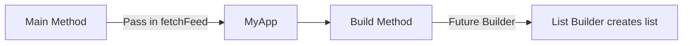

# Warframe Alert Feed Flutter App

Uses an RSS Feed on the internet and parses it into a list in flutter.
The app uses no Stateful widgets and is very small.

## App Design

## Future Updates

- More Platforms
- Stateful Widgets for use input in menus
- Refresh

## More about Flutter

For help getting started with Flutter, view our
[online documentation](https://flutter.dev/docs), which offers tutorials,
samples, guidance on mobile development, and a full API reference.
